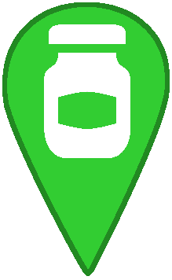

# Ajouter des commerces acceptant les contenants

## Fonctionnement de CartoVrac

CartoVrac différencie trois types de commerces qui ne sont pas gérés de la même manière :
1. les épiceries et supermarchés bio comportant un rayon vrac
2. les épiceries itinérants dédiées à la vente en vrac
3. les autres commerces acceptant que les clients utilisent leurs propres contenants

Une différenciation est faite entre les commerces avec rayon vrac et les commerces acceptant les contenants :
- **les commerces avec rayon vrac** n'acceptent pas forcement les contenants. Certains commerces n'autorisent que l'utilisation de sacs en papier, d'autres accepteront de faire la tarre pour que les clients utilisent leurs propres sacs en tissus, bocaux et autres contenants. Même s'il n'est pas possible d'utiliser ses propres contenants il est généralement possible de réutiliser les sacs fournis par le commerce. Parmi les commerces avec rayon vrac nous ne prenons pas en compte les commerces de types primeurs, restaurants, boulangeries, boucheries, charcuteries, poissonneries... pour lesquels les produits ne sont pas nécessairement emballés avant l'achat. Ces derniers sont valorisés sur CartoVrac uniquement s'ils acceptent que les clients ramènent leurs propres contenants.
- **les commerces acceptant les contenants** sont généralement des commerces fabriquant eux-même leurs produits ou travaillant directement avec des producteurs. Les produits ne sont pas emballés avant l'achat et le client peut choisir d'utiliser l'emballage proposé par le commerçant, de ramener son propre emballage ou même de ne pas utiliser d'emballage. Les commerces que nous retrouvons souvent dans cette catégorie sont : primeurs, restaurants, boulangeries, pâtisseries, boucheries, charcuteries, poissonneries ...

### Épiceries et supermarchés bio. avec rayon vrac

Sur CartoVrac sont affichés entre autre les épiceries et supermarchés bio. comportant un rayon vrac ou étant dédiés à la vente en vrac.

Les données concernant ces commerces sont récupérées automatiquement depuis OpenStreetMap, une base de données cartographiques libre et couvrant le monde entier.

La base de données OpenStreetMap est utilisée et complétée par des milliers d'utilisateurs et contributeurs. Les données ajoutées par ses contributeurs sont libres de droits et faciles à extraire du fait de sa structures et des outils qui sont associés à OpenStreetMap.

Il est possible de consulter les données OpenStreetMap sur https://openstreetmap.org ou encore http://osm.org

Pour les épiceries et supermarchés bio. avec rayon vrac, nous avons fait le choix d'utiliser OpenStreetMap comme base de données cartographiques pour de multiple raisons :
- il est facile d'extraire les commerces comportant un rayon vrac grâce à un champs de données dédié au vrac (permettant de différencier les commerces sans rayon vrac, les commerces ayant un rayon vrac et les commerces dédiés au vrac)
- les données sont régulièrement mises à jour par des milliers de contributeurs
- l'équipe CartoVrac peut facilement contribuer à OpenStreetMap en y ajoutant des commerces vrac et les voir apparaître automatiquement sur CartoVrac (l'équipe CartoVrac a ajouté plus de 1500 commerces sur OpenStreetMap à ce jour).
- tous les ajouts effectués sur OpenStreetMap par l'équipe CartoVrac profite également à tous les autres projets utilisant OpenStreetMap
- n'importe qui, ne faisant pas partie de l'équipe CartoVrac, peut également ajouter des commerces de vente en vrac sur OpenStreetMap et ces ajouts seront automatiquement affichés sur CartoVrac.
- le jeu de données des commerces vrac maintenu par CartoVrac sur la France métropolitaine ne dépend pas de la vie du projet CartoVrac. Si le projet CartoVrac est amené à être arrêté, les données persisteront puisqu'elles ne sont pas liées au projet.

Ces avantages définissent l'identité de CartoVrac et le différencie des autres cartes de commerces de vrac. Nous avons par ce biais voulu créer un jeu de données pérenne et réutilisable afin de faire face aux nombreuses cartes de vrac isolées, pas forcement maintenues à jour et difficilement réutilisables. Nous encourageons d'ailleurs les autres cartes de commerces de vrac à réutiliser ce jeu de données que nous maintenons, à y contribuer et à ne pas hésiter à rentrer en contact avec nous s'ils souhaitent mettre en place un système similaire.

Afin de récupérer le plus de données possible CartoVrac encourage et accompagne ses utilisateurs à contribuer à OpenStreetMap. Nous avons également ajouté un bouton "Ajouter un commerce" sur la carte, renvoyant vers un formulaire nous permettant de récupérer facilement des données concernant les commerces de vente en vrac. Nous ajoutons ensuite manuellement ces données sur OpenStreetMap.

Sur la carte les commerces avec rayons vrac sont affichés une fois extrait d'OpenStreetMap suivant trois catégories :
- les épiceries dédiées au vrac {: height="35px" }
- les épiceries comportant un rayon vrac mais dont l'activité commerciale n'est pas dédiée au vrac 
- les supermarchés bio. comportant un rayon vrac mais dont l'activité commerciale n'est pas dédiée au vrac 

### Épiceries itinérantes dédiées au vrac

Certains commerces effectuent de la vente en vrac en utilisant un point de vente mobile. Nous voyons ce genre d'initiative se développer de plus en plus sur les marchés, en association avec d'autres commerces ou encore en se liant à des AMAPs. Généralement ces commerces se déplacent à l'aide d'une camionnette comportant les conteneurs vrac intégrés à l'intérieur de la camionnette. 

OpenStreetMap, utilisé pour récupérer les données concernant les commerces avec rayon vrac (décrit précédemment), ne permet cependant pas de référencer les commerces n'ayant pas de point de vente fixe.
Nous avons donc fait le choix de créer notre propre jeu de données pour ce type de commerce et de le partager sous licence libre. 

Dans ce jeu de données chaque commerce est identifié par son nom et un lien décrivant ses horaires de présence ainsi que la liste de ses positions géographiques.

Les commerces vrac itinérants sont ensuite affichés sur CartoVrac et identifiés par le biais de ce logo : 

### Commerces acceptant les contenants

Nous considérons dans la catégorie "Commerces acceptant les contenants", l'ensemble des commerces ne disposant pas de rayon vrac comme décrit dans la catégorie "Épiceries et supermarchés bio. avec rayon vrac" mais acceptant de vendre leur produits sans emballage. 

Il est possible de référencer ces commerces sur OpenStreetMap. Cependant il n'est actuellement pas possible d'identifier les commerces acceptant les contenants avec OpenStreetMap, comme nous pouvons le faire pour les rayons vrac.

Afin d'afficher les commerces acceptant les contenants sur CartoVrac, nous devons donc connaître l'identifiant OpenStreetMap de chacun des commerce. Cette opération demande beaucoup de temps et nécessite de maintenir à jour cette liste d'identifiants (nouveau commerce acceptant les contenants / changement de politique du commerce souhaitant sortir de la démarche...). Par conséquent, nous ne pouvons pas nous permettre de maintenir cette liste à jour pour toute la France métropolitaine.

Afin d'offrir ce contenu au plus grand nombre, nous déléguons donc ce travail à des collectifs, associations et services publiques valorisant déjà ce travail à l'échelle de leur région. Ces entités disposent déjà de listes de commerçants acceptant les contenants de leurs clients et les maintiennent à jour. Nous mettons alors un système afin de partager facilement cette liste et d'afficher les commerces dans cette démarche sur CartoVrac.

Un exemple de réalisation est le partenariat que nous avons avec le collectif citoyen J'aime tes Bocaux sur la région nantaise. Le collectif référence une centaine de commerces dans cette démarche. Nous les affichons alors sur la carte avec dans l'info bulle du commerce, une bannière "Partenaire J'aime tes Bocaux" ainsi que le logo du collectif.

## Devenir partenaire sur le référencement de commerçants acceptant les contenants

Pour devenir partenaire et voir affiché sur CartoVrac la liste des commerçants que vous avez référencé, il suffit de :

1. Nous contacter par email et nous expliquer votre démarche : contact@cartovrac.fr
2. Nous conviendrons ensuite d'un entretien téléphonique pour mettre en place le partenariat
3. A la suite de l'entretien téléphonique nous vous enverrons un document partagé sur lequel vous pourrez nous transmettre la liste de vos commerçants
4. Pour chacun de vos commerçants, nous vous demandons de les ajouter sur https://openstreetmap.org et de copier les liens OpenStreetMap des commerces dans le document partagé que nous vous avons fourni
5. Nous nous chargeons d'ajouter vos commerces sur CartoVrac avec les liens OpenStreetMap fournis
6. Nous vous partageons le code HTML qui vous permettra à votre souhait d'intégrer CartoVrac zoomé sur votre région pour votre site internet 

### Référencer un commerce sur OpenStreetMap

Voici un tutoriel qui explique comment contribuer à OpenStreetMap : https://learnosm.org/fr/beginner/start-osm/

En résumé, voici les étapes que vous devrez suivre pour ajouter vos commerces :
1. Rendez vous sur https://osm.org

2. Connectez-vous à votre compte OpenStreetMap ou créez en un si vous n'en possédez pas déjà

3. Vous êtes connecté.

4. Faites une recherche pour vérifier que le commerce que vous souhaitez ajouter n’est pas déjà référencé. Ici, nous allons prendre pour exemple l’épicerie « la Consigne » à Cherbourg. Comme le montre la
copie d’écran suivante, la recherche n’a rien donné.

Si la recherche est fructueuse et que le commerce est déjà référencé, vérifiez si les attributs suivants sont renseignés et corrects : nom, adresse, type de magasin, site web. (ces attributs sont détaillés plus loin). 

Si ce n’est pas le cas, recherchez le commerce à l'aide de son adresse postale : 

5. Cliquez sur modifier, ce qui va vous permettre de faire un référencement. 

Si c’est la première fois que vous vous connectez et que vous contribuez à OSM en cliquant sur « modifier », un tutoriel d’utilisation de mode d’édition vous est proposé. Nous vous conseillons vivement de le suivre afin de vous familiariser avec la contribution sur OSM, ce qui va vous permettre de suivre la suite du présent tutoriel, qui ne reprend pas les éléments explicatifs du tutoriel d’OSM.

6. cliquez sur "point" en haut de la carte

7. Positionnez le curseur de la souris sur le bâtiment où se trouve votre commerce et cliquez.

La barre « que souhaitez-vous ajouter » s’affiche. Dans « rechercher » entrez le type de commerce à référencer : épicerie/supérette, magasin biologique, boulangerie, boucherie ... puis sélectionnez le.

8. Remplissez à minima les champs suivants :
    - Nom
    - Adresse complète
    - Site web si possible (sur « ajouter un champ » entrez « Site Web »)

9. Renouvelez l'opération pour l'ensemble des commerces que vous souhaitez ajouter

10. Une fois terminé, cliquez sur "sauvegarder" sur le dessus de la carte 

11. Remplissez les motivations de votre ajout (Exemple : "Ajout de commerces acceptant les contenants") puis validez votre enregistrement

Les ajouts sont immédiats sur OpenStreetMap.

### Ajouter le lien OpenStreetMap sur le document partagé

Une fois que vous avez fait vos ajouts, rendez vous sur https://osm.org de nouveau. Ensuite, recherchez vos commerces un par un, sélectionnez le commerce une fois trouvé et copiez l'adresse web du site.

L'adresse devrait ressembler à quelque chose comme : https://www.openstreetmap.org/node/5594452333

Copiez alors ce lien dans la colonne "Lien OpenStreetMap" du document partagé, en face du commerce que vous avez recherché.
